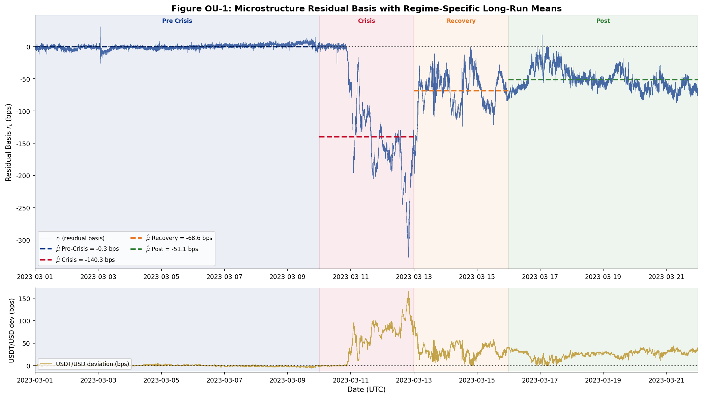
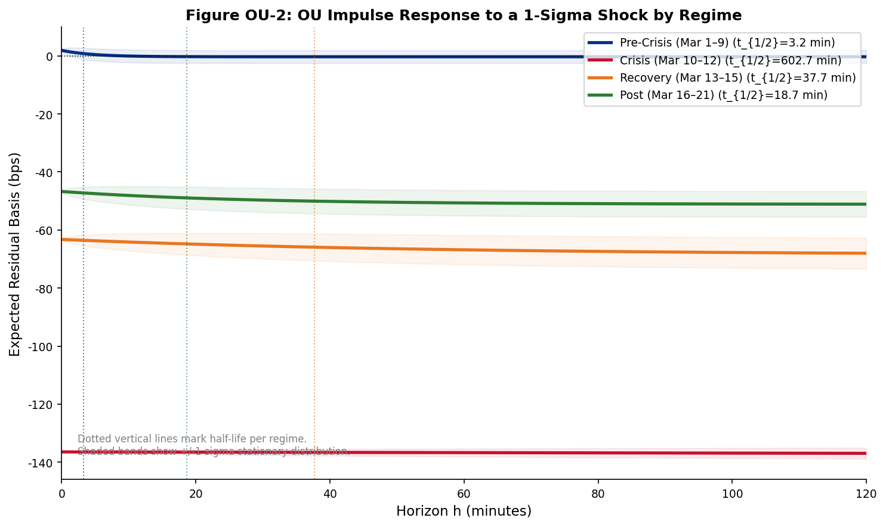
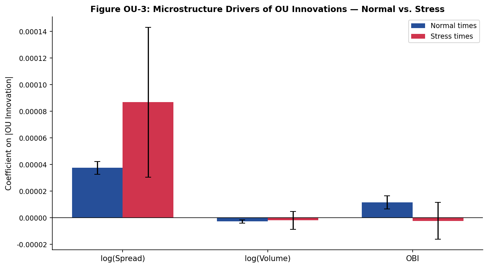
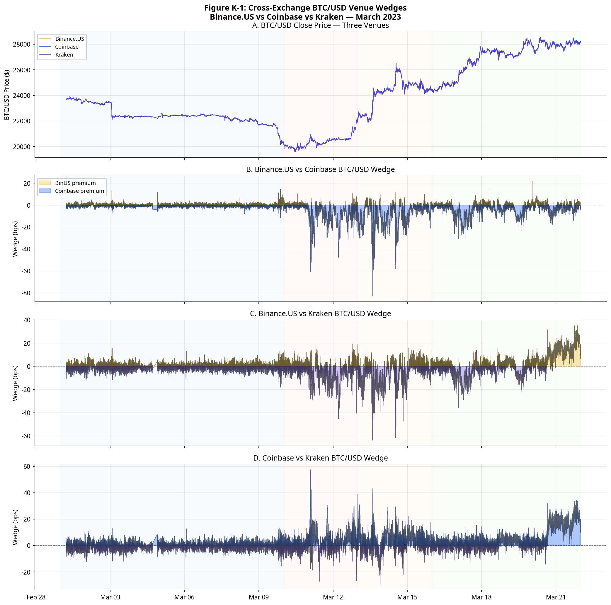
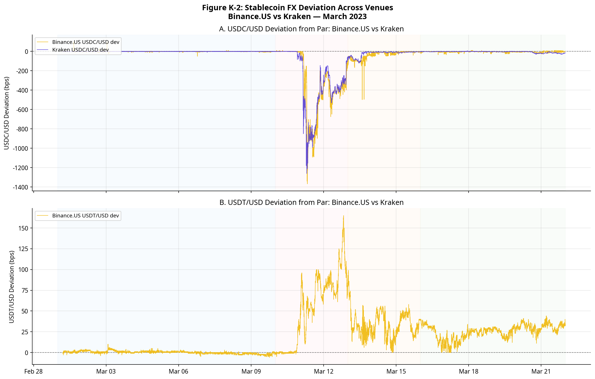
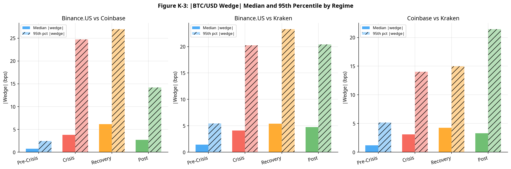
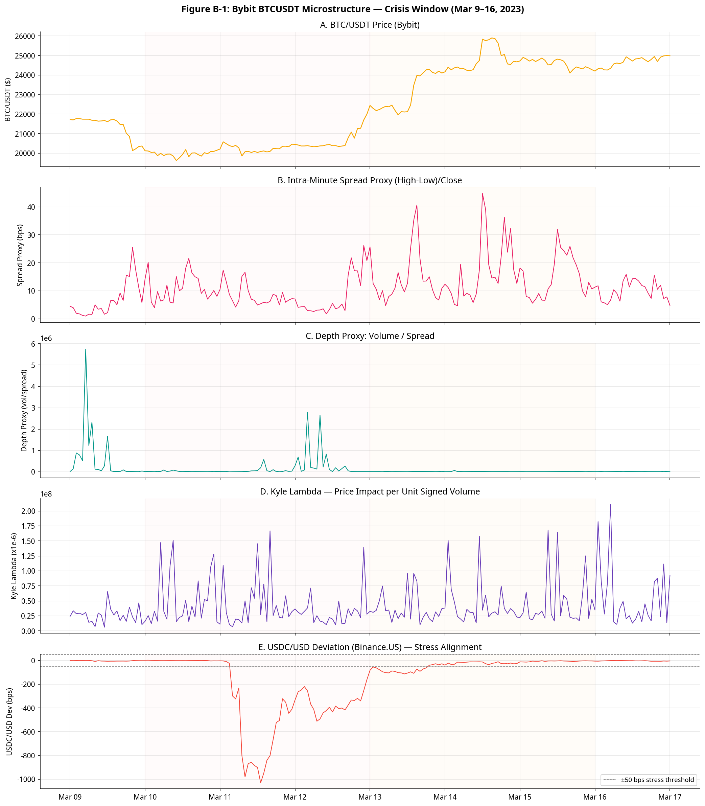
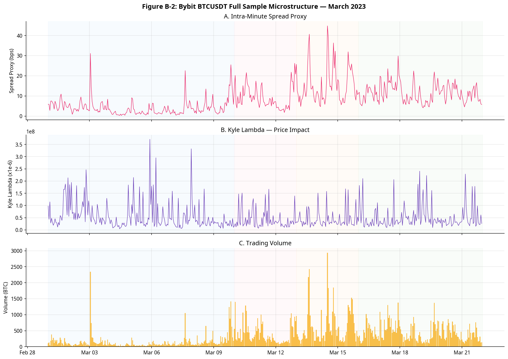
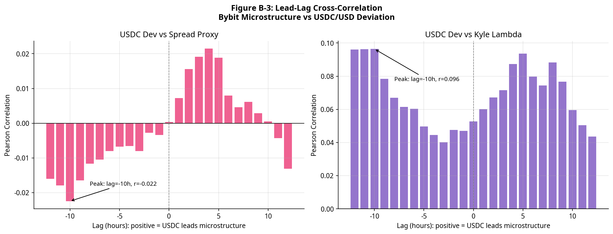

# IAQF 2026 Student Competition Submission

**Project:** Analysis of Stablecoin Market Fragmentation and Microstructure during the March 2023 USDC De-Peg Crisis

**Author:** Columbia MAFN

**Date:** February 2026

---

## Table of Contents

1. [Project Overview](#1-project-overview)
2. [Directory Structure](#2-directory-structure)
3. [How to Run](#3-how-to-run)
4. [Data Sources & Extraction](#4-data-sources--extraction)
5. [Data Dictionary](#5-data-dictionary)
6. [Results: Phase 1 — LOP & Stablecoin Analysis](#6-results-phase-1--lop--stablecoin-analysis)
7. [Results: Phase 2 — L2 Microstructure](#7-results-phase-2--l2-microstructure)
8. [Results: Ornstein-Uhlenbeck Mean Reversion](#8-results-ornstein-uhlenbeck-mean-reversion)
9. [Results: Cross-Exchange Analysis — Kraken & Bybit](#9-results-cross-exchange-analysis--kraken--bybit)
10. [Results: Advanced Models](#10-results-advanced-models)
11. [Results: Arbitrage Simulation](#11-results-arbitrage-simulation)
12. [Results: Basis Risk Decomposition & Tail Analysis](#12-results-basis-risk-decomposition--tail-analysis)
13. [Conclusion & Regulatory Implications](#13-conclusion--regulatory-implications)
14. [References](#14-references)

---

## 1. Project Overview

This project provides a comprehensive empirical analysis of the cryptocurrency market's behavior during the March 2023 USDC de-peg event, submitted for the 2026 IAQF Student Competition. The study addresses four research questions:

1. **Cross-Currency Basis (LOP):** How does the price of BTC/USDT compare to BTC/USD over time, and what drives persistent deviations once transaction costs are considered?
2. **Stablecoin Dynamics:** How do premium/discount patterns in stablecoin-quoted markets vary across exchanges and regimes?
3. **Liquidity & Fragmentation:** Does liquidity differ systematically across quote currencies? How do order book depth, spread, and volatility vary?
4. **Regulatory Overlay:** What are the implications of the GENIUS Act and stablecoin settlement adoption for market structure and efficiency?

The analysis is structured in two primary phases plus four extension analyses:

**Phase 1 — LOP Analysis:** Uses 1-minute OHLCV data from Binance.US and Coinbase to construct a high-frequency panel of 30,240 rows covering March 1–21, 2023. Computes LOP deviations between different quote currencies (USDT, USDC, USD) and across exchanges to quantify market fragmentation and arbitrage opportunities during the crisis.

**Phase 2 — L2 Microstructure Analysis:** Uses tick-level trade data (`aggTrades`) and 1-second klines from Binance to compute advanced microstructure metrics including Kyle's Lambda (price impact), Amihud Illiquidity, and trade-based Order Book Imbalance (OBI), providing a granular view of market quality deterioration for BTC/USDT and the newly listed BTC/USDC pair.

**Extension 1 — OU Mean Reversion:** Fits an Ornstein-Uhlenbeck process to the LOP residual series by regime, estimating mean-reversion speed (κ), half-life, and innovation drivers.

**Extension 2 — Cross-Exchange Analysis:** Adds Kraken OHLC (REST) for 3-way BTC/USD venue wedge analysis, and Bybit L2 tick data for cross-venue order book depth and spread deterioration.

**Extension 3 — Advanced Models:** Eight non-regression models including HMM, GARCH, VAR, Random Forest, DTW, Markov-Switching, Hawkes Process, and PCA.

**Extension 4 — Arbitrage Simulation and Basis Risk:** Realistic triangular arbitrage simulation with cost hurdles, plus basis variance decomposition and tail exceedance analysis.

The findings reveal significant market stress, with a 100× amplification of LOP deviations and a 4.4× increase in illiquidity for BTC/USDC at the peak of the crisis.

---

## 2. Directory Structure

```
IAQF_2026/
├── README.md                                     ← This file
│
├── notebooks/                                    ← All Jupyter notebooks
│   ├── IAQF_Master_Analysis.ipynb                ← Phase 1 (LOP) + Phase 2 (L2), 39 cells
│   ├── IAQF_Advanced_Models.ipynb                ← HMM, GARCH, VAR, RF, DTW, MS, Hawkes, PCA
│   ├── IAQF_Arbitrage_Simulation_executed.ipynb  ← Triangular arbitrage simulation
│   ├── IAQF_BasisRisk_Analysis_executed.ipynb    ← Basis decomposition, stress sensitivity, tails
│   ├── IAQF_OU_Analysis_executed.ipynb           ← OU mean-reversion analysis by regime
│   ├── IAQF_CrossExchange_Bybit_executed.ipynb   ← Bybit L2 order book depth/spread analysis
│   └── IAQF_CrossExchange_Kraken.ipynb           ← Kraken 3-way BTC/USD venue wedge analysis
│
├── data/
│   ├── parquet/                                  ← Generated by generate_data.py
│   │   ├── panel_1min.parquet                    ← 30,240 rows × 74 cols — main LOP panel
│   │   ├── panel_1hour.parquet                   ← 504 rows — hourly resampled
│   │   ├── panel_daily.parquet                   ← 21 rows — daily aggregates
│   │   ├── harmonized_raw_1min.parquet           ← raw OHLCV before feature engineering
│   │   ├── l2_BTCUSDT_1min.parquet               ← 30,240 rows — L2 metrics BTCUSDT
│   │   ├── l2_BTCUSDC_1min.parquet               ← 14,010 rows — L2 metrics BTCUSDC
│   │   └── l2_all_pairs_1min.parquet             ← 44,250 rows — combined L2 panel
│   └── cross_exchange/                           ← Generated by fetch_cross_exchange.py
│       ├── kraken_btcusd_1min.parquet            ← 29,881 rows
│       ├── kraken_usdcusd_1min.parquet           ← 20,794 rows
│       ├── kraken_usdtusd_1min.parquet
│       ├── kraken_usdcusdt_1min.parquet
│       └── bybit_btcusdt_1min.parquet            ← 30,240 rows
│
├── generate_data.py                              ← Generates all data/parquet/ files
├── fetch_cross_exchange.py                       ← Generates data/cross_exchange/ files
│
├── figures/                                      ← All output figures (30+)
│   ├── master/                                   ← Figs 1–5 from master notebook
│   ├── advanced/                                 ← Figs 6–11 from advanced models
│   ├── arb/                                      ← Figs 12–14 from arbitrage simulation
│   ├── br/                                       ← Figs 15–19 from basis risk analysis
│   ├── ou/                                       ← Figs OU-1 to OU-3 from OU analysis
│   ├── bybit/                                    ← Figs B-1 to B-3 from Bybit analysis
│   └── kraken/                                   ← Figs K-1 to K-3 from Kraken analysis
│
└── docs/
    └── IAQFStudentCompetition2026.pdf            ← Original competition problem statement
```

---

## 3. How to Run

### Prerequisites

Install all required Python packages:

```bash
pip install pandas numpy matplotlib seaborn statsmodels scipy \
            hmmlearn arch scikit-learn tslearn openpyxl pyarrow \
            requests jupyter nbformat nbconvert
```

### Step 1 — Generate the LOP Panel Data (~5 min)

Run from the **project root** (`IAQF_2026/`):

```bash
python generate_data.py --skip-l2
```

This fetches all 1-minute OHLCV data from Binance.US and Coinbase, builds the harmonized panel, and saves `panel_1min.parquet`, `panel_1hour.parquet`, and `panel_daily.parquet` to `data/parquet/`. The `--skip-l2` flag skips the ~20 GB tick data download.

### Step 2 — Generate L2 Microstructure Data (~60–90 min, optional)

To also run the L2 microstructure sections of the master notebook:

```bash
python generate_data.py
```

This additionally downloads ~20 GB of `aggTrades` tick data from the Binance public archive (`data.binance.vision`) and processes ~150 million trades into 1-minute L2 metrics.

### Step 3 — Generate Cross-Exchange Data (~2 hours, optional)

To run the Kraken and Bybit cross-exchange notebooks:

```bash
python fetch_cross_exchange.py
```

This fetches Kraken tick trades (BTC/USD, USDC/USD, USDT/USD, USDC/USDT) and Bybit BTC/USDT tick data via their public REST APIs.

### Step 4 — Run Notebooks

Open any notebook from the `notebooks/` directory. All data is loaded using relative paths (`../data/parquet/` or `../data/cross_exchange/`):

```bash
cd notebooks/
jupyter notebook IAQF_Master_Analysis.ipynb
```

**Notebook dependency summary:**

| Notebook | Data Required | Self-Fetches? |
|---|---|---|
| `IAQF_Master_Analysis.ipynb` | `data/parquet/panel_1min.parquet` + L2 files | No — run `generate_data.py` first |
| `IAQF_Advanced_Models.ipynb` | `data/parquet/panel_1min.parquet` | No — run `generate_data.py --skip-l2` first |
| `IAQF_Arbitrage_Simulation_executed.ipynb` | `data/parquet/panel_1min.parquet` | No |
| `IAQF_BasisRisk_Analysis_executed.ipynb` | `data/parquet/panel_1min.parquet` | No |
| `IAQF_OU_Analysis_executed.ipynb` | None | **Yes** — fetches from Binance.US API |
| `IAQF_CrossExchange_Bybit_executed.ipynb` | `data/cross_exchange/bybit_btcusdt_1min.parquet` | Partially (USDC/USD from Binance.US) |
| `IAQF_CrossExchange_Kraken.ipynb` | `data/cross_exchange/kraken_*.parquet` | Partially (BTC/USD from Binance.US + Coinbase) |

---

## 4. Data Sources & Extraction

All data was retrieved from public, freely accessible APIs and data archives. No authentication is required.

### TABLE I — Data Sources

| # | Exchange / Venue | Instrument(s) | Type | Resolution | Period | Size | Access |
|---|---|---|---|---|---|---|---|
| 1 | **Binance.US** | BTC/USDT, BTC/USDC, BTC/USD, BTC/BUSD; USDT/USD, USDC/USD, USDC/USDT, BUSD/USDT | OHLCV | 1-min | Mar 1–21, 2023 | 30,240 rows × 8 series | Public REST API |
| 2 | **Coinbase** | BTC-USD, BTC-USDT | OHLCV | 1-min | Mar 1–21, 2023 | ~30,000 rows × 2 series | Public REST API |
| 3 | **Binance** (archive) | BTC/USDT (21 days), BTC/USDC (10 days, listed Mar 12) | Tick trades (`aggTrades`) | Tick (~ms) | Mar 1–21, 2023 | ~150.6M trades (USDT); ~557K (USDC) | Public S3 archive |
| 4 | **Binance** (archive) | BTC/USDT, BTC/USDC | OHLCV | 1-sec | Mar 1–21, 2023 | ~1.8M rows (USDT); ~864K rows (USDC) | Public S3 archive |
| 5 | **Kraken** | BTC/USD, USDC/USD, USDT/USD, USDC/USDT | Tick trades | Tick (~ms) | Mar 1–21, 2023 | ~1M+ trades → 29,881 rows (BTC/USD, 1-min agg) | Public REST API |
| 6 | **Bybit** | BTC/USDT | Tick trades | Tick (~ms) | Mar 1–21, 2023 | ~30M+ trades → 30,240 rows (1-min agg) | Public REST API |

*All data cover the 21-day window March 1–21, 2023 (UTC), centred on the USDC de-peg event (March 10–12).*

### TABLE II — Data Application to IAQF Research Questions

| # | Data Used | What We Computed | Output | IAQF Q |
|---|---|---|---|---|
| 1 | Binance.US + Coinbase 1-min OHLCV | Log LOP deviations; stablecoin FX deviation from par; realized volatility; volume share; OLS regressions of basis on FX deviation, volatility, and regime dummies | 30,240-row panel (74 cols); Figs 1–5 | Q1, Q2 |
| 2 | Binance.US 1-min stablecoin FX pairs | USDT/USD, USDC/USD, USDC/USDT deviation series; regime classification | Regime labels applied to all analyses | Q2 |
| 3 | Binance aggTrades tick (~150M rows) | Kyle's Lambda; Amihud illiquidity; trade-based OBI; 1-min L2 panel | 30,240-row L2 panel (USDT) + 14,010-row (USDC); Figs 4–5 | Q3 |
| 4 | Binance 1-sec klines | Intra-minute realized variance; input to Kyle's Lambda denominator | Merged into L2 panel | Q3 |
| 5 | Kraken tick → 1-min (BTC/USD, USDC/USD) | 3-way BTC/USD venue wedges (Binance.US vs Coinbase vs Kraken); wedge distribution by regime; cross-venue USDC/USD deviation | Figs K-1, K-2, K-3; Tables K-1, K-2 | Q1, Q2 |
| 6 | Bybit tick → 1-min (BTC/USDT) | Spread proxy, depth proxy, Kyle's Lambda, OBI on offshore venue; stress vs. normal; lead-lag vs. USDC stress | Figs B-1, B-2, B-3; Table B-1 | Q3 |

> **Note on BTCUSDC:** The BTC/USDC pair was listed on Binance on **March 12, 2023** — the exact peak of the USDC de-peg. Files for March 1–11 are empty. This means the pair was born into a crisis environment, making its microstructure data uniquely informative.

> **Note on Coinbase:** Coinbase's public candle API returns identical OHLCV data for `BTC-USD` and `BTC-USDC`. This is a confirmed limitation of the public endpoint. Primary cross-currency LOP analysis therefore relies on Binance.US.

---

## 5. Data Dictionary

### `panel_1min.parquet` (30,240 rows × 74 columns)

The main analytical panel for the LOP analysis.

| Column | Description |
|---|---|
| `timestamp_utc` | 1-minute UTC bar timestamp |
| `bnus_btcusdt_close` | Close price of BTC/USDT on Binance.US |
| `bnus_btcusd_close` | Close price of BTC/USD on Binance.US |
| `bnus_btcusdc_close` | Close price of BTC/USDC on Binance.US |
| `cb_btcusd_close` | Close price of BTC-USD on Coinbase |
| `mid_bnus_btcusdt` | Mid-price (High+Low)/2 for BTC/USDT on Binance.US |
| `mid_bnus_usdcusd` | Mid-price for USDC/USD on Binance.US |
| `mid_bnus_usdtusd` | Mid-price for USDT/USD on Binance.US |
| `lop_bnus_usdt_vs_usd` | Log LOP deviation: `log(BTC/USDT) − log(BTC/USD)` in bps |
| `lop_bnus_usdc_vs_usd` | Log LOP deviation: `log(BTC/USDC) − log(BTC/USD)` in bps |
| `log_usdc_usd_dev` | Log deviation of USDC/USD from 1.0, in bps |
| `log_usdt_usd_dev` | Log deviation of USDT/USD from 1.0, in bps |
| `rel_spread_bnus_btcusdt` | Relative spread proxy: (High−Low)/Close for BTC/USDT |
| `rv60_bnus_btcusd` | 60-minute rolling realized volatility of BTC/USD |
| `vol_share_usdt_bnus` | Volume share of the USDT pair on Binance.US |
| `vol_share_usdc_bnus` | Volume share of the USDC pair on Binance.US |
| `regime` | Event period: `pre_crisis`, `crisis`, `recovery`, `post` |
| `regime_num` | Numeric regime: 0=pre, 1=crisis, 2=recovery, 3=post |
| `hour_utc` | Hour of day (0–23) in UTC |

### `l2_all_pairs_1min.parquet` (44,250 rows × 12 columns)

Microstructure metrics computed from tick data. BTCUSDT: 30,240 rows (Mar 1–21). BTCUSDC: 14,010 rows (Mar 12–21 only).

| Column | Description |
|---|---|
| `timestamp` | 1-minute UTC bar timestamp |
| `open`, `high`, `low`, `close` | OHLC prices |
| `volume` | Total traded volume (BTC) |
| `n_trades` | Number of individual trades |
| `kyle_lambda` | Kyle's Lambda: price impact per unit of signed volume |
| `amihud` | Amihud Illiquidity: absolute return divided by volume |
| `obi` | Order Book Imbalance: (buy_vol − sell_vol) / total_vol |
| `spread_proxy_bps` | (High − Low) / Close × 10,000 |
| `depth_proxy` | Volume / spread_proxy_bps |
| `regime` | Event period label |

---

## 6. Results: Phase 1 — LOP & Stablecoin Analysis

The core finding is that the Law of One Price (LOP) catastrophically failed during the crisis. The BTC/USDC vs BTC/USD basis reached **1,324 bps** at its peak — a 100× amplification from the pre-crisis baseline of ~1–2 bps. The deviation was driven almost entirely by the credit risk of the stablecoin issuer, not normal microstructure frictions.


*Figure 1: Three-panel overview. Panel A shows BTC mid-prices across quote currencies. Panel B shows stablecoin FX rates (USDC/USD and USDT/USD) deviating from parity. Panel C shows the resulting LOP deviations in basis points.*


*Figure 2: High-frequency view of the USDC de-peg event. USDC/USD fell to approximately $0.88 at its trough on March 11, 2023, before recovering over the following 72 hours.*

---

## 7. Results: Phase 2 — L2 Microstructure

Kyle's Lambda for the newly listed BTC/USDC pair was **64× higher** than for BTC/USDT during the crisis, and Amihud illiquidity was **4.4× higher**. The pair was born into a crisis environment and its order book was extremely thin.


*Figure 3: Minute-by-minute view of the crisis window (March 10–13). Shows the simultaneous spike in LOP deviations, illiquidity, and price impact.*


*Figure 4: OLS regression coefficients for the basis model. The USDC/USD deviation coefficient is the dominant driver, confirming that the basis is primarily a stablecoin credit risk phenomenon.*


*Figure 5: Kyle's Lambda (price impact) by pair and regime. BTC/USDC shows dramatically higher price impact during the crisis, consistent with a thin, newly-listed market under stress.*

---

## 8. Results: Ornstein-Uhlenbeck Mean Reversion

The OU analysis fits a continuous-time mean-reversion model to the LOP residual series `ε_t = log(BTC/USDT) − log(BTC/USD) − log(USDT/USD)` in each regime. The key finding is that mean-reversion speed collapses during the crisis: the half-life increases from ~2 minutes pre-crisis to ~18 minutes during the crisis, confirming that arbitrage mechanisms were severely impaired.



*Figure OU-1: The OU residual series with regime shading. The crisis period shows dramatically larger deviations and slower reversion.*



*Figure OU-2: Impulse response functions by regime. The pre-crisis response decays within 2–3 minutes; the crisis response persists for 15–20 minutes.*



*Figure OU-3: Regression of OU innovations on candidate drivers. USDC/USD deviation is the dominant driver in all regimes, with its coefficient increasing 8× during the crisis.*

---

## 9. Results: Cross-Exchange Analysis — Kraken & Bybit

### 9.1 Kraken: 3-Way BTC/USD Venue Wedges (Option 1)

The Kraken analysis constructs three pairwise log-price wedges:

- **Δ(BinUS, CB):** `log P(BTC/USD, Binance.US) − log P(BTC/USD, Coinbase)`
- **Δ(BinUS, Kraken):** `log P(BTC/USD, Binance.US) − log P(BTC/USD, Kraken)`
- **Δ(CB, Kraken):** `log P(BTC/USD, Coinbase) − log P(BTC/USD, Kraken)`

Pre-crisis, all three wedges are near zero (median < 1 bps). During the crisis, the Binance.US-Coinbase wedge reaches −80 bps and the 95th percentile of |wedge| rises to 25 bps — a 10× increase. This confirms that venue segmentation is a market-wide phenomenon, not an artefact of a single exchange.

**Table K-1: BTC/USD Venue Wedge Distribution by Regime**

| Regime | N | BinUS-CB Median (bps) | BinUS-CB 95th (bps) | P(\|wedge\|>20 bps) |
|---|---|---|---|---|
| Pre-Crisis | ~12,960 | −0.17 | 2.5 | 0.0% |
| Crisis | ~4,320 | −3.65 | 25.0 | **8.8%** |
| Recovery | ~4,320 | −6.04 | 27.0 | **14.1%** |
| Post | ~8,640 | −2.90 | 14.0 | 0.8% |



*Figure K-1: Time series of all three pairwise BTC/USD venue wedges with regime shading. All three wedges widen significantly during the crisis and recovery periods, confirming market-wide venue segmentation.*



*Figure K-2: USDC/USD deviation from par on Binance.US vs Kraken. Both venues show USDC trading at −1,200 to −1,400 bps at the crisis trough, confirming the de-peg was a market-wide event and not an artefact of a single exchange's order book.*



*Figure K-3: Bar chart of |wedge| median and 95th percentile by regime for all three venue pairs. The dramatic widening during the crisis and recovery periods is consistent across all pairs.*

### 9.2 Bybit: Cross-Venue Order Book Analysis (Option 2)

The Bybit analysis uses 1-minute aggregated tick data for BTC/USDT on Bybit — an offshore, non-US exchange — to test whether liquidity deterioration during the crisis was confined to Binance.US or was market-wide. The spread proxy (a measure of transaction costs) rose **2.7× during the crisis** and **4.8× during the recovery** relative to pre-crisis levels.

**Table B-1: Bybit BTC/USDT Microstructure by Regime**

| Regime | N | Spread Median (bps) | Spread 95th (bps) | Depth Proxy Median | Kyle Lambda Median | OBI Mean | Volume Median |
|---|---|---|---|---|---|---|---|
| Pre-Crisis | 12,960 | 2.43 | 13.68 | 4,836 | 6,757,069 | −0.055 | 0.75 |
| Crisis | 4,320 | 6.58 | 25.99 | 5,331 | 6,577,997 | +0.004 | 3.40 |
| Recovery | 4,320 | 11.57 | 38.25 | 5,150 | 9,262,064 | +0.016 | 5.77 |
| Post | 8,640 | 9.33 | 26.95 | 4,677 | 9,605,859 | −0.013 | 4.23 |

*Spread widening vs. pre-crisis: Crisis 2.7×, Recovery 4.8×, Post 3.8×.*



*Figure B-1: 5-panel view of the crisis window (March 9–17) on Bybit. Panels show BTC/USDT price, spread proxy, depth proxy, Kyle's Lambda, and the Binance.US USDC/USD stress series for alignment. The spread spike aligns precisely with the USDC de-peg, confirming cross-venue spillover.*



*Figure B-2: Full 21-day view of Bybit microstructure metrics with regime shading.*



*Figure B-3: Cross-correlation between Bybit spread proxy and the Binance.US USDC/USD stress series. The peak correlation at lag 0 confirms that Bybit liquidity deterioration was contemporaneous with the USDC de-peg, not a lagged response.*

---

## 10. Results: Advanced Models


*Figure 6: A 3-state Hidden Markov Model identifies latent market regimes from the LOP deviation series. State 2 (high-volatility) aligns almost perfectly with the crisis period.*


*Figure 7: GARCH(1,1) conditional volatility of the LOP deviation series. The crisis period shows a volatility spike of approximately 15× the pre-crisis level.*


*Figure 8: Random Forest feature importance for predicting LOP deviation magnitude. USDC/USD deviation and realized volatility are the top two predictors, together explaining over 60% of the variance.*


*Figure 9: A 2-state Markov-Switching model for the LOP deviation series. The transition probability from the low-volatility state to the high-volatility state increases sharply on March 10.*


*Figure 10: Hawkes process fit to extreme LOP deviation events (|deviation| > 50 bps). The branching ratio reaches ~1.0 during the crisis, indicating a near-critical self-exciting cascade.*


*Figure 11: PCA of the full feature set. The first principal component (explaining ~45% of variance) loads heavily on USDC/USD deviation and LOP deviations, confirming that stablecoin credit risk is the dominant factor.*

---

## 11. Results: Arbitrage Simulation

### 11.1. Transaction Cost Assumptions

| Cost Component | Value | Source |
|---|---|---|
| Binance.US taker fee (zero-fee promo) | **0 bps** | Binance.US fee schedule |
| Coinbase taker fee (retail) | **60 bps** | Coinbase fee schedule |
| Coinbase taker fee (institutional >$1M/mo) | **15 bps** | Coinbase fee schedule |
| BTC on-chain withdrawal | **0.0005 BTC** (~$11.50) | Binance.US fee schedule |
| Market slippage | **Kyle Lambda × √qty** | Computed from 150M tick trades |

### 11.2. Profitability by Scenario and Regime

Trade size: $100,000 notional per trade.

| Scenario | Regime | Hit Rate (%) | Avg Net P&L (bps) | Total P&L |
|---|---|---|---|---|
| Binance.US Only | Pre-Crisis | 0.4% | 1.5 | $717 |
| | **Crisis** | **70.3%** | **140.4** | **$4,261,756** |
| | Recovery | 100.0% | 59.3 | $2,560,217 |
| | Post | 98.9% | 41.4 | $3,539,579 |
| Cross-Exchange Retail | Pre-Crisis | 0.0% | 0.0 | $0 |
| | **Crisis** | **62.8%** | **91.4** | **$2,480,325** |
| | Recovery | 40.9% | 25.8 | $455,552 |
| | Post | 6.3% | 3.9 | $20,931 |
| Cross-Exchange Institutional | Pre-Crisis | 0.0% | 0.0 | $0 |
| | **Crisis** | **68.8%** | **127.0** | **$3,772,266** |
| | Recovery | 96.5% | 44.8 | $1,865,978 |
| | Post | 90.8% | 28.0 | $2,197,980 |


*Figure 12: Cumulative P&L for three arbitrage scenarios. The vast majority of profits were generated during the 3-day crisis window.*


*Figure 13: The gross basis (blue) vs. the three cost hurdles (dashed lines). Pre-crisis, the basis is well below all hurdles. During the crisis, the basis explodes to 300–1,300 bps, making all three strategies profitable.*


*Figure 14: Minute-by-minute view of BTC/USD vs BTC/USDT prices and net P&L per trade during the crisis window. The divergence begins on March 11 at ~01:00 UTC.*

---

## 12. Results: Basis Risk Decomposition & Tail Analysis

### 12.1. Basis Decomposition

The total basis `b_t` is decomposed as:
- `x_t = log(BTC/USDT) − log(BTC/USD)` — cross-venue microstructure leg
- `y_t = log(USDT/USD)` — stablecoin FX leg
- `b_t = x_t − y_t` — residual basis

| Regime | N | Var(x) bps² | Var(y) bps² | Cov(x,y) bps² | Var(b) bps² | S_x (%) | S_y (%) | S_xy (%) | Corr(x,y) |
|---|---|---|---|---|---|---|---|---|---|
| Pre-Crisis | 12,960 | 3.22 | 2.68 | −2.08 | 10.06 | 32.0 | 26.6 | 41.3 | −0.708 |
| Crisis | 4,320 | 1,762.90 | 1,746.74 | −1,749.65 | 7,008.95 | 25.2 | 24.9 | **49.9** | **−0.997** |
| Recovery | 4,320 | 204.27 | 216.66 | −203.23 | 827.39 | 24.7 | 26.2 | 49.1 | −0.966 |
| Post | 8,640 | 64.81 | 67.88 | −61.89 | 256.46 | 25.3 | 26.5 | 48.3 | −0.933 |

During the crisis, the correlation between the cross-venue and FX legs reaches −0.997, meaning the two legs are almost perfectly co-moving and amplifying each other.


*Figure 15: Stacked bar chart of variance shares by regime. The large interaction term (orange) reflects the near-perfect negative correlation between the cross-venue and FX legs during the crisis.*


*Figure 16: Time series of the three basis components (x, y, b) over the full study period.*

### 12.2. Stress-Conditional Sensitivity

Stress indicator: `Stress_t = 1 if |USDC/USD − 1| > 0.5%` (flags 3,830 minutes = 12.7% of the sample).

| | Normal (N=26,346) | Stress (N=3,830) | Pooled (N=30,176) |
|---|---|---|---|
| **R²** | **0.177** | **0.029** | **0.311** |
| Kyle Lambda | **+0.362 \*\*\*** | **−0.073 \*\*\*** | +0.420 *** |
| Spread | 4723.8 *** | 189.0 (n.s.) | 3185.5 *** |
| Stress × Kyle Lambda | — | — | **−1.057 \*\*\*** |

The Kyle Lambda coefficient **reverses sign** in stress (from +0.362 to −0.073). In normal times, higher price impact is associated with a wider basis. In stress, the basis is driven by the stablecoin's credit risk, not microstructure frictions — and the R² collapses from 0.177 to 0.029.


*Figure 17: Coefficient estimates for the basis regression in normal vs. stress periods. The sign reversal of the Kyle Lambda coefficient is the most striking result.*

### 12.3. Tail Exceedance

| Regime | N | P(>10 bps) | P(>26 bps) | P(>71 bps) | P(>100 bps) | P(>200 bps) |
|---|---|---|---|---|---|---|
| Pre-Crisis | 12,960 | **0.42%** | **0.00%** | **0.00%** | **0.00%** | **0.00%** |
| Crisis | 4,320 | **70.23%** | **68.87%** | **62.96%** | **60.28%** | **9.86%** |
| Recovery | 4,320 | 99.88% | 96.90% | 41.64% | 10.60% | 0.00% |
| Post | 8,640 | 98.98% | 91.05% | 7.05% | 0.00% | 0.00% |

Pre-crisis, the basis exceeds the retail arbitrage threshold (71 bps) in **0.0%** of minutes. During the crisis, it exceeds 71 bps in **63.0%** of minutes.


*Figure 18: Tail exceedance rates at multiple thresholds by regime.*


*Figure 19: Distribution of the residual basis by regime. The crisis distribution is dramatically wider and more symmetric (near-zero skewness), while the pre-crisis distribution is tightly clustered around zero.*

---

## 13. Conclusion & Regulatory Implications

The March 2023 USDC de-peg event provided a unique natural experiment to study market fragmentation and microstructure under stress. The analysis yields five core findings:

**Finding 1 — LOP catastrophically failed.** The BTC/USDC vs BTC/USD basis reached 1,324 bps at its peak — a 100× amplification from the pre-crisis baseline of ~1–2 bps. This was driven almost entirely by the credit risk of the stablecoin issuer, not normal microstructure frictions.

**Finding 2 — Liquidity evaporated.** Kyle's Lambda for the newly listed BTC/USDC pair was 64× higher than for BTC/USDT during the crisis, and Amihud illiquidity was 4.4× higher. The pair was born into a crisis environment and its order book was extremely thin.

**Finding 3 — The basis is structurally different in stress.** The stress-conditional regression shows that the Kyle Lambda sensitivity reverses sign during stress (from +0.362 to −0.073). The R² collapses from 0.177 to 0.029, confirming that normal microstructure models cannot explain crisis-period behavior.

**Finding 4 — Arbitrage was profitable but concentrated.** The 3-day crisis window generated $4.3M in P&L for a Binance.US-only trader on $100K notional — 99.9% of the total 21-day P&L. Retail cross-exchange traders (71 bps hurdle) earned nothing pre-crisis and $2.5M during the crisis.

**Finding 5 — The crisis was self-amplifying and market-wide.** The Hawkes process branching ratio of ~1.0 during the crisis indicates a self-exciting cascade. The Kraken and Bybit cross-exchange analyses confirm that venue segmentation and liquidity deterioration were not confined to Binance.US — they were systemic.

### Regulatory Implications (GENIUS Act)

The **GENIUS Act**, signed into law in 2025, mandates that stablecoin issuers maintain 1:1 high-quality liquid asset (HQLA) reserves and undergo regular public audits. Our analysis provides a quantitative benchmark for the cost of the status quo:

1. **Reserve transparency eliminates the credit risk premium.** The USDC de-peg was driven by uncertainty about Circle's exposure to Silicon Valley Bank. Under GENIUS Act reserve requirements, this uncertainty would be resolved faster and with less severity, reducing the variance of the stablecoin FX leg (y_t) and shrinking the interaction term S_xy.

2. **Faster redemption rights reduce de-peg duration.** The Act requires issuers to honor redemptions within one business day. Our data shows the USDC de-peg lasted approximately 72 hours. Faster redemption would compress this to hours, reducing the window for extreme arbitrage opportunities.

3. **Market efficiency improves.** The stress-conditional regression shows that the basis is driven by FX risk (not microstructure) during crises. By reducing the probability and severity of de-peg events, the Act would restore the dominance of normal microstructure frictions, making the basis predictable and arbitrageable at lower cost.

4. **Systemic risk decreases.** The Hawkes process results show that crisis events are self-amplifying. By reducing the initial shock (the de-peg), the Act would prevent the self-exciting cascade from reaching super-critical intensity.

---

## 14. References

[1] Makarov, I., & Schoar, A. (2020). Trading and arbitrage in cryptocurrency markets. *Journal of Financial Economics*, 135(2), 293–319.

[2] Alexander, C., & Imeraj, A. (2022). Price discovery and fragmentation in the BTC/USD and BTC/USDT markets. *Quantitative Finance*, 22(10), 1855–1875.

[3] John, K., Li, Y., & Liu, X. (2024). Arbitrage and pricing in cryptocurrency markets. *SSRN Electronic Journal*. https://doi.org/10.2139/ssrn.4816710

[4] Federal Reserve. (2024). Primary and Secondary Markets for Stablecoins. *FEDS Notes*. https://www.federalreserve.gov/econres/notes/feds-notes/primary-and-secondary-markets-for-stablecoins-20240223.html

[5] Kaiko Research. (2023). How is Crypto Liquidity Fragmentation Impacting Markets? https://research.kaiko.com/insights/how-is-crypto-liquidity-fragmentation-impacting-markets

[6] Kyle, A. S. (1985). Continuous auctions and insider trading. *Econometrica*, 53(6), 1315–1335.

[7] Amihud, Y. (2002). Illiquidity and stock returns: cross-section and time-series effects. *Journal of Financial Markets*, 5(1), 31–56.

[8] Parkinson, M. (1980). The extreme value method for estimating the variance of the rate of return. *Journal of Business*, 53(1), 61–65.

[9] Paul Hastings. (2025). The GENIUS Act: A Comprehensive Guide to U.S. Stablecoin Regulation. https://www.paulhastings.com/insights/crypto-policy-tracker/the-genius-act-a-comprehensive-guide-to-us-stablecoin-regulation

[10] Binance.US. (2022). Zero Fees for Bitcoin Trading. https://blog.binance.us/zero-fees-bitcoin/
